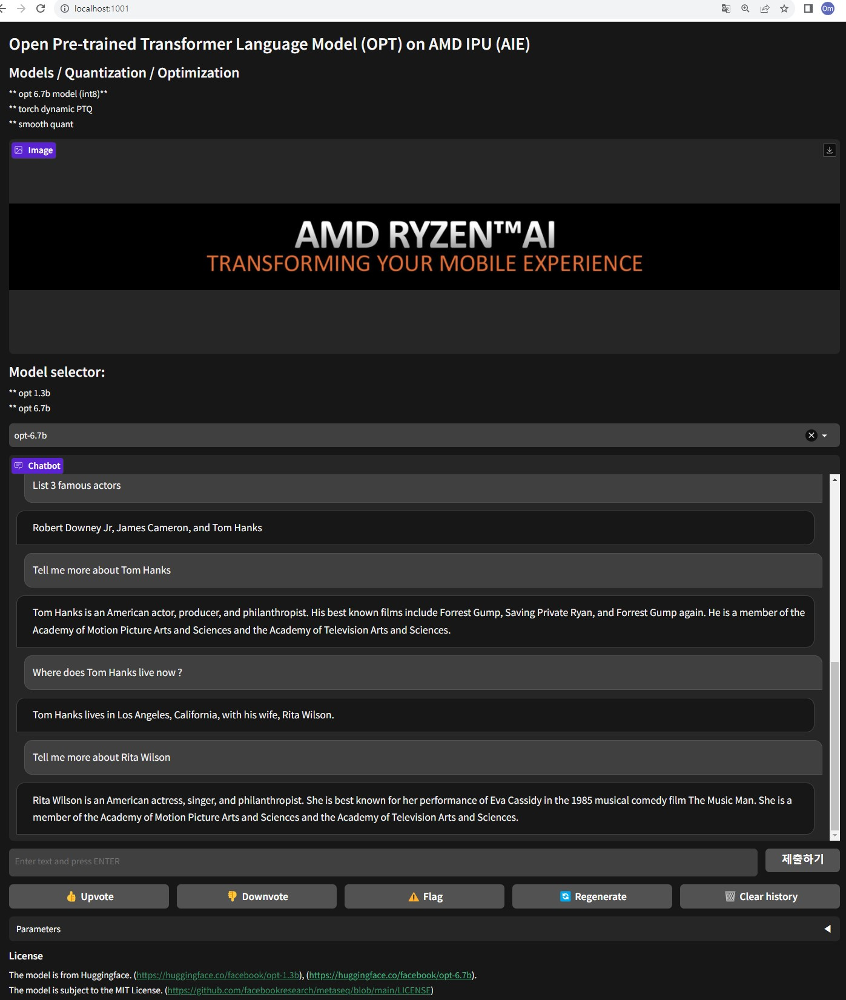
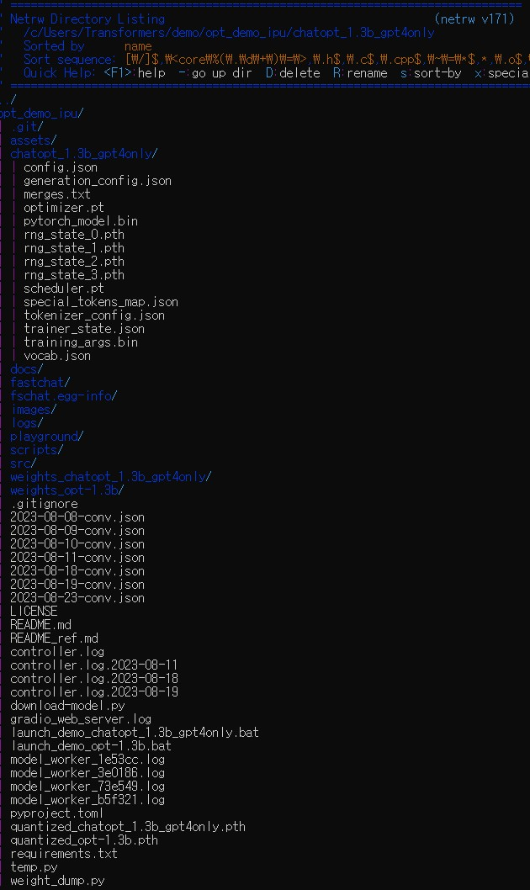
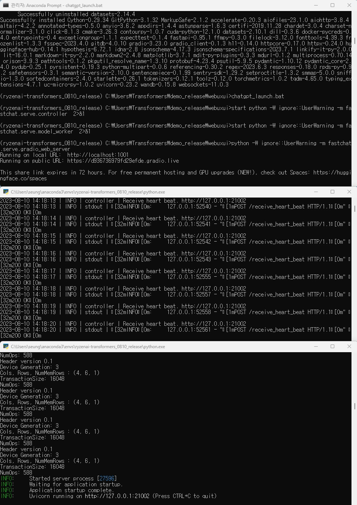

# OPT demo on Ryzen AI IPU
OPT demo user interface for serving and evaluating GPT-based Chatbot. 
The demo system consists of three parts. 
- Web ux/ui: Provides user interface with configurable parameters, such as temperature for token decoding sampling & max output token length
- Model worker: Launches, OPT models in quantizable format so that IPU can offload Matmul kernel operations. 
- Controller: Links Model worker and Web ux/ui

## News
- Web ux/ui sample

<a ></a>

## Install

### Launch anaconda prompt as an administrator and follow these steps
1. IPU compatible matmul kernel registeration

Install git in the beginning
```bash
conda install -c anaconda git
```
Clone the IPU transformers environment repo (https://gitenterprise.xilinx.com/VitisAI/transformers/tree/release_2) 
Follow instructions in the README 
Install the packages to the following path:
C:\Users\Transformers\transformers

2. Clone this repository (https://github.com/seungrokjung/opt_demo_ipu.git) to the following folder:
C:\Users\Transformers\demo\opt_demo_ipu

```bash
cd C:\Users\Transformers\demo
git clone https://github.com/seungrokjung/opt_demo_ipu.git
cd C:\Users\Transformers\demo\opt_demo_ipu
```

3. Install Package
```bash
pip install -r requirements.txt
```

4. Model quantization, Model demo launch
4.1. open-source model: facebook/opt-1.3b:

Quantize the model:
```bash
python weight_dump.py   --action save --model_path facebook/opt-1.3b
```

You can see the quantized torch model in the current directory.
```bash
quantized_opt-1.3b.pth
```

Launch a demo script and wait a 2-3 minutes until the quantized model is loaded to ddr. 
This script lanches 1) controller, 2) model worker, and 3) web ux/ui separately.
```bash
launch_demo_opt-1.3b
```

4.2. AMD's fine-tuned opt1.3b model: chatopt_1.3b_gpt4only:
Copy the model to the current directory
cp -rf chatopt_1.3b_gpt4only .
After you copy the model, the model folder in the current path should look like this:
<a ></a>

Quantize the model:
```bash
python weight_dump.py   --action save --model_path local_dir/chatopt_1.3b_gpt4only
```

You can see the quantized torch model in the current directory.
```bash
quantized_chatopt_1.3b_gpt4only.pth
```

Launch a demo script and wait a 2-3 minutes until the quantized model is loaded to ddr. 
This script lanches 1) controller, 2) model worker, and 3) web ux/ui separately.
```bash
launch_demo_chatopt_1.3b_gpt4only
```

7. Once the demo is ready, the environment will look like this (The ERROR message in controller window is negligible):
<a ></a>

8. Open a web browswer and navigate to "localhost:1001". Default username/password for the uxui are "amd/7890".


## Modification

You can change demo uxui interface by changing the markdown here:
https://github.com/seungrokjung/opt_demo_ipu/blob/5a45c31b1e869d35cc72e12b1f03b7f65a061574/fastchat/serve/gradio_web_server.py#L240

## Restrictions

##